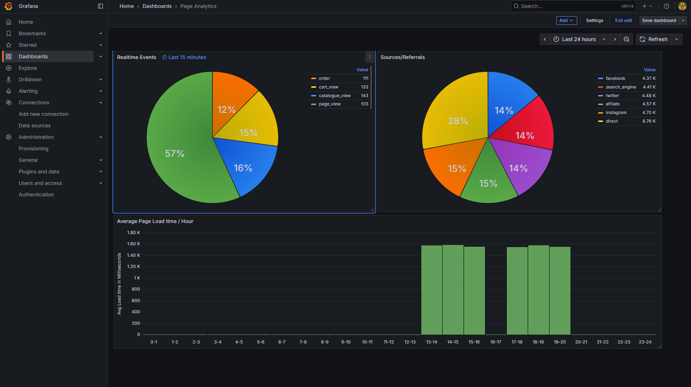
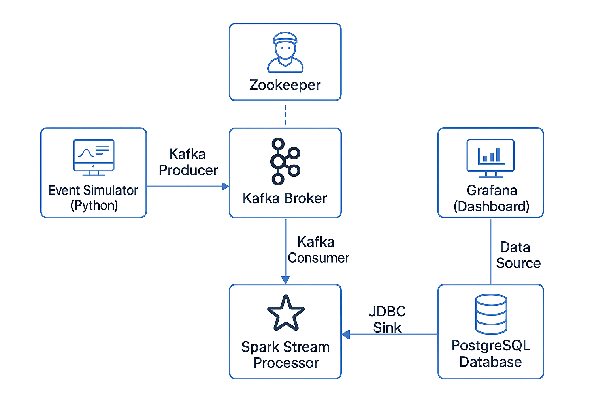
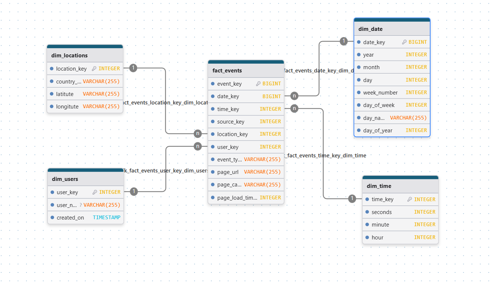

# 📊 Ecommerce Page View Streaming Data Pipeline - End to End

This project implements an end-to-end streaming analytics pipeline to capture, process, and visualize web page view events in real-time. The architecture utilizes **Docker** and **Docker Compose** to orchestrate several key technologies, including **Kafka**, **Spark Streaming**, **PostgreSQL**, and **Grafana**.



## ✨ Architectural Design and Data Flow

The pipeline follows a classic **Lambda Architecture** pattern for real-time data processing, utilizing the following core components:



| Component | Technology | Role |
| :--- | :--- | :--- |
| **Event Simulation** | Python (`simulator.py`) | Generates and publishes simulated web page view events to a Kafka topic. |
| **Messaging/Streaming** | **Kafka** (with **ZooKeeper**) | Acts as the central message broker for reliable, high-throughput ingestion of events. |
| **Stream Processing** | **Apache Spark** (Structured Streaming) | Consumes events from Kafka, performs real-time transformations and aggregations, and loads the results into PostgreSQL. |
| **Data Storage** | **PostgreSQL** | Persists the processed and aggregated streaming data for long-term storage and dashboarding. |
| **Visualization** | **Grafana** | Connects to PostgreSQL to create a real-time analytics dashboard of web page view statistics. |
| **Orchestration** | **Docker** & **Docker Compose** | Defines and runs the multi-container application environment. |


---

## 🛢️ Data Warehouse Schema (Dimensional Model)

The data ingested by Spark is structured in a Star Schema within PostgreSQL, optimizing the data for fast analytical queries and reporting via Grafana.



Type | Table Name| Description
| :--- | :--- | :--- |
Dimension | `dim_date` | Date attributes (Day of Week, Day of Month, Month, Year, Week Number).
Dimension | `dim_time` | Time attributes (Hour, Minute, Second).
Dimension | `dim_locations` | Geographical data (Country, Latitude, Longitude).
Dimension | `dim_users` | User profile information.
Fact (Raw/Detailed) | `fact_events` | Stores every individual web page view event, linked to all dimensions.
Fact (Aggregated/Streaming) | `fact_events_realtime_agg` | Stores pre-aggregated metrics from the Spark Structured Stream (e.g., count of events per 15-minute window). This is the primary source for the Grafana dashboard.

---

## ⚙️ Running the Pipeline

These instructions will get a copy of the project up and running on your local machine.

### Prerequisites

* **Docker** (Latest stable version)
* **Docker Compose** (Usually included with Docker Desktop)
* Sufficient RAM (Recommended **8GB+**) as this setup runs several heavy services (Kafka, Spark).

### Installation and Execution

1.  **Clone the repository:**
    ```bash
    git clone https://github.com/chaitanya-vanapamala/ecom-page-analytics-streaming-e2e
    cd ecom-page-analytics-streaming-e2e
    ```

2.  **Start the pipeline:**
    The following command will build all custom images, download external images, and start all services in the correct order based on health checks and dependencies.

    ```bash
    docker compose up --build -d
    ```
    * The services may take a few minutes to become healthy (especially `broker` and `database`).

3.  **Verify Services:**
    You can check the status of all containers:
    ```bash
    docker compose ps
    ```
    All services should eventually show a **healthy** status (where applicable) or be **Up**.

---

## 💻 Accessing Services

Once the pipeline is running, you can access the various service UIs:

| Service | Port | URL | Credentials/Notes |
| :--- | :--- | :--- | :--- |
| **Grafana Dashboard** | `3000` | `http://localhost:3000` | Default Grafana login: `admin`/`admin`. You will be prompted to change the password. |
| **Confluent Control Center** | `9021` | `http://localhost:9021` | Monitoring and management for Kafka. |
| **PostgreSQL** | `5432` | N/A | Connect via your preferred SQL client using credentials defined in your `./database` setup. |

### Post-Deployment Setup (Grafana)

After accessing Grafana (`localhost:3000`):

1.  **Add PostgreSQL Data Source:**
    * Click the **Configuration** gear icon -> **Data Sources**.
    * Click **Add data source** -> Select **PostgreSQL**.
    * Configure the connection:
        * **Host:** `database:5432` (or `localhost:5432` if connecting from outside the Docker network).
        * **Database:** `page_analytics`
        * **User:** `analytics_owner`
        * **Password:** `<Your Database Password>`
    * Click **Save & Test**.

2.  **Import/Create Dashboard:**
    * Import `page-analytics-grafana.json` at dashboard creation.

---

## ⚙️ Key Configuration Details

### Kafka (Broker & ZooKeeper)

* **Internal Broker Address:** `broker:29092`
* **External Broker Address:** `localhost:9092`
* The event simulator publishes to a Kafka topic that your Spark processor consumes.

### Spark Processing (`event-processing`)

* The Spark service runs a `spark-submit` command defined in `compose.yaml`.
* It automatically downloads necessary packages for **Kafka integration** (`spark-sql-kafka-0-10`) and **PostgreSQL driver** (`postgresql`).
* The application code is located at `/opt/spark-apps/stream_processor.py` inside the container.

### PostgreSQL (`database`)

* **Build Context:** `./database` (Assumes a Dockerfile and initial SQL scripts for database and table creation).
* **Default Database:** `page_analytics`
* **Default User:** `analytics_owner`
* **Schema & Initial Data:** Dimension Model Schema and default data will be loaded through sql files in `./database` folder.

---

## 🔗 Connect with Me

You can find more of my work and connect with me on the following platforms:

LinkedIn: [/chaitanya-vanapamala](https://www.linkedin.com/in/chaitanya-vanapamala/)
